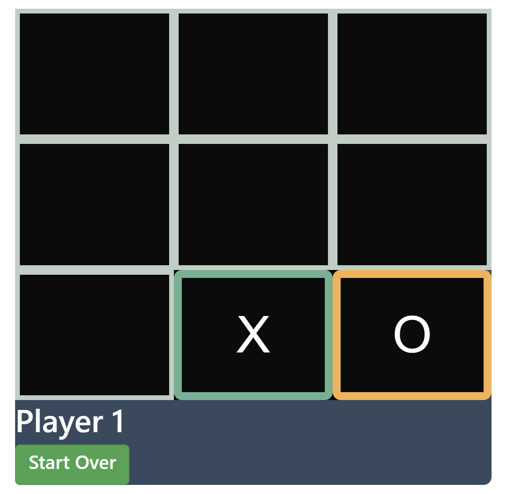

# TIK-TAK-TOE GAME

## Description of the project:
 This is a classic game. Tic-Tac-Toe is a two-player game where players take turns marking spaces in a 3x3 grid with either an "X" or an "O." The objective is to be the first to form a horizontal, vertical, or diagonal line of three of your own marks. I added a preditermined color for each player. This game is in its first stages, I got a bug getting the winner sing for the player 0. This bug i want to fix in next oportunity. If youy can do it please let me know how you did it. I will love your imput.

## How to Run:
To run this repo you just need to firk this repo and in your terminal bash just type the following to show in into the broswer server:

### 1. go to git bash and run:
#### a. go to the location of the html file you want to open in the browser. then type:
npm install -global http-server
#### b.then type:
http-server -c-1

## Roadmap of future improvements:
There are numerous improvements and additions that can be implemented in this game. Beside tficing the bug mentioned before at the description. My goal is to introduce extra features such as implement code that prevents players from overwriting a square that already has an X or O. Additionally, I want to include functionality that disables the squares/buttons once a winner is determined, and a "Start Over" button pops up to reset the game for the players to begin again.

I would you implement those features by maybe initializing a Boolean state variable called "isFilled" to false using useState to start the game. Then, in the handleOnClick function of the Square component, after updating all other state variables, I would set setIsFilled to true. Additionally, I would add a conditional statement at the beginning of the function to check if "isFilled" is true, and if so, return early to prevent further execution.

Additionally, for the next implementation, I will utilize a useState variable named "buttonReset" initialized to false. Then, I will create a function called "reset" that sets "buttonReset" to true and updates the game state, which holds the array of squares, setting all of them to null. This setup will be implemented in the Board component, which serves as the parent component.

## License information:
MIT license.

## Support
If you have any questions, please don't hesitate to contact me julieth. Also I'm open to your ideas and suggestions, and I'm confident that our combined talents could lead to exciting and innovative results. If you're interested in discussing potential projects or exchanging ideas, please let me know.

Let's start a conversation and see where our collaboration might take us.
